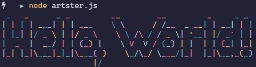

# Artster

A simple project that lets the user display the text in FIGfont in rainbow colors.

## Table of Contents

- [Screenshot](#screenshot)
- [Usage](#usage)
- [Text and Font](#text-and-font)
  - [Use own text](#use-own-text)
  - [Choose font](#choose-font)
- [Acknowledgements](#acknowledgements)

## Screenshot



## Usage

Install dependecies.

```console
npm i
```

Simple usage:

```console
node artster.js
```

Output:

```
  _   _      _ _         __        __         _     _ _
 | | | | ___| | | ___    \ \      / /__  _ __| | __| | |
 | |_| |/ _ \ | |/ _ \    \ \ /\ / / _ \| '__| |/ _` | |
 |  _  |  __/ | | (_) |    \ V  V / (_) | |  | | (_| |_|
 |_| |_|\___|_|_|\___( )    \_/\_/ \___/|_|  |_|\__,_(_)
                     |/
```

## Text and Font

### Use own text

Use own text:

```console
node artster.js --text='Hello, sunshine!'
```

Output:

```
  _   _      _ _                              _     _            _
 | | | | ___| | | ___     ___ _   _ _ __  ___| |__ (_)_ __   ___| |
 | |_| |/ _ \ | |/ _ \   / __| | | | '_ \/ __| '_ \| | '_ \ / _ \ |
 |  _  |  __/ | | (_) |  \__ \ |_| | | | \__ \ | | | | | | |  __/_|
 |_| |_|\___|_|_|\___( ) |___/\__,_|_| |_|___/_| |_|_|_| |_|\___(_)
                     |/
```

### Choose font

Get the list of fonts:

```console
node artster.js --fonts
```

Set the font:

```console
node artster.js --font='Dancing Font'
```

Output:

```
  _   _  U _____ u  _       _       U  ___ u                     U  ___ u   ____      _      ____    _
 |'| |'| \| ___"|/ |"|     |"|       \/"_ \/      __        __    \/"_ \/U |  _"\ u  |"|    |  _"\ U|"|u
/| |_| |\ |  _|" U | | u U | | u     | | | |      \"\      /"/    | | | | \| |_) |/U | | u /| | | |\| |/
U|  _  |u | |___  \| |/__ \| |/__.-,_| |_| |      /\ \ /\ / /\.-,_| |_| |  |  _ <   \| |/__U| |_| |\|_|
 |_| |_|  |_____|  |_____| |_____|\_)-\___/_     U  \ V  V /  U\_)-\___/   |_| \_\   |_____||____/ u(_)
 //   \\  <<   >>  //  \\  //  \\      \\ (")    .-,_\ /\ /_,-.     \\     //   \\_  //  \\  |||_   |||_
(_") ("_)(__) (__)(_")("_)(_")("_)    (__) \|     \_)-'  '-(_/     (__)   (__)  (__)(_")("_)(__)_) (__)_)
```

## Acknowledgements

- [Yargs](https://github.com/yargs/yargs) - For the beautiful interactive command line
- [Figlet](https://github.com/patorjk/figlet.js) - For the display of FIGfont spec
- [Colors](https://github.com/Marak/colors.js) - For the rainbow colors implemented on the displayed text
